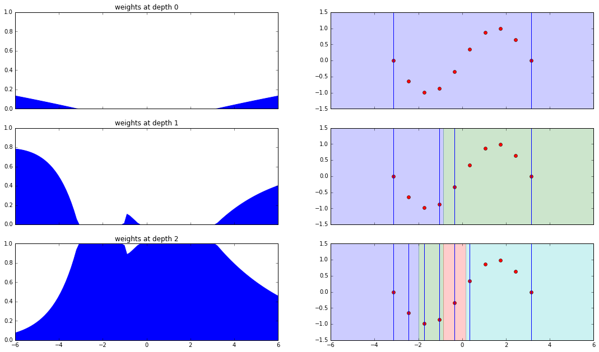
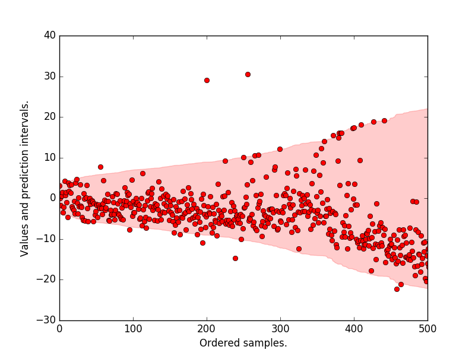

# Scikit-Garden

[](https://travis-ci.org/scikit-garden/scikit-garden)
[](https://circleci.com/gh/scikit-garden/scikit-garden)

Scikit-Garden or skgarden (pronounced as skarden) is a garden for Scikit-Learn compatible decision trees and forests.

#### Weights at different depths of a MondrianTree


#### Ordered prediction intervals on the Boston dataset.



## Installation

Scikit-Garden can be installed using pip.

```
pip install scikit-garden
```

## Available models

### Regressors
* MondrianForestRegressor
* ExtraTreesRegressor (with `return_std` support)
* ExtraTreesQuantileRegressor
* RandomForestRegressor (with `return_std` support)
* RandomForestQuantileRegressor

### Classifiers
* MondrianForestClassifier

## Usage

The estimators in Scikit-Garden are Scikit-Learn compatible and can serve as a drop-in replacement for Scikit-Learn's trees and forests.

```python
from sklearn.datasets import load_boston
X, y = load_boston()

### Use MondrianForests for variance estimation
from skgarden import MondrianForestRegressor
mfr = MondrianForestRegressor()
mfr.fit(X, y)
y_mean, y_std = mfr.predict(X, return_std=True)

### Use QuantileForests for quantile estimation
from skgarden import RandomForestQuantileRegressor
rfqr = RandomForestQuantileRegressor(random_state=0)
rfqr.fit(X, y)
y_mean = rfqr.predict(X)
y_median = rfqr.predict(X, 50)
```

## Important links
-  API Reference: https://scikit-garden.github.io/api/
-  Examples: https://scikit-garden.github.io/examples/
