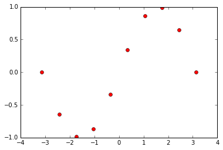
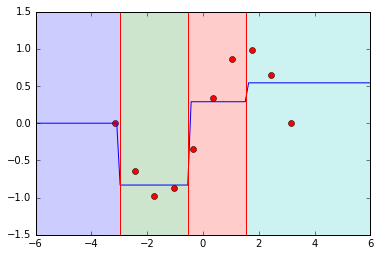

This example provides an intuition behind the MondrianTreeRegressor. In particular, the key differences between an extremely randomized tree and explanations of the tree construction and prediction will be higlighted.


```python
# Import necessary stuff
import numpy as np
import matplotlib.pyplot as plt
from sklearn.tree import ExtraTreeRegressor
from skgarden import MondrianTreeRegressor
from itertools import cycle
%matplotlib inline
```

##  Extremely Randomized Tree - Recap

In every tree-based algorithm, the decision rule at every node is constructed by considering a set of candidate split points and that candidate split point that minimizes a certain impurity (generally the mse in case of continuous values) is chosen. In an extremely randomized tree, the number of candidate splits `S` are limited to `n_features` and each candidate split `S[i]` is drawn unifomly from the bounds `(l_f[i], u_f[i])`.

In a single extremely randomized tree, this construction might seem suboptimal but while constructing an ensemble of trees, it makes sure that each tree constructed in an independent fashion. And also limiting the number of candidate split points makes the tree construction very fast. Let us now generate some toy data.


```python
def generate_toy_data(n_points=10):
    X_train = np.linspace(-np.pi, np.pi, n_points)
    y_train = np.sin(X_train)
    X_test = np.linspace(-6.0, 6.0, 100)
    y_test = np.sin(X_test)
    return np.expand_dims(X_train, axis=1), y_train, np.expand_dims(X_test, axis=1), y_test

X_train, y_train, X_test, y_test = generate_toy_data()
plt.plot(X_train.ravel(), y_train, "ro")
plt.show()
```





## Plotting decision boundaries using ERT's

Let us now scikit-learn's ExtraTreeRegressor to predict on unseen data and to plot decision boundaries. Also, we set the `max_depth` parameter to 2, which means there can be a maximum of 4 decision boundaries in the 1-D space.


```python
def plot_1D_decision_boundaries(tree_reg, plt):
    x_l, x_u = plt.xlim()
    colors = cycle("bgrcmyk")
    split_thresh = tree_reg.tree_.threshold
    split_thresh = sorted(split_thresh[split_thresh != -2])
    split_thresh = [x_l] + split_thresh + [x_u]
    for s in split_thresh:
        plt.axvline(s, color="r", linestyle="-")

    for x_l, x_u in zip(split_thresh[1:], split_thresh[:-1]):
        plt.fill_between((x_l, x_u), -1.5, 1.5, alpha=0.2, color=next(colors))

etr = ExtraTreeRegressor(random_state=2, max_depth=2)
etr.fit(X_train, y_train)
y_pred = etr.predict(X_test)
plt.plot(X_train.ravel(), y_train, "ro")
plt.plot(X_test.ravel(), y_pred)
plt.ylim((-1.5, 1.5))
plot_1D_decision_boundaries(etr, plt)
plt.show()
```





The blue line represents the prediction in every region of the decision space.

We notice that as we move away from the training data

1. The predicted mean remains constant.
2. It is determined by the decision split at the bounds of the space.

Ideally, as move away from the training data we are unsure about the target value to predict and would like to fall back on some prior mean. The mondrian tree solves this problem in a very intelligent way.

##  Mondrian Tree

### Train time

At every node, the split threshold and feature is decided independently of the target or the decrease in impurity! Yes, that is right.

1. The split feature index `f` is drawn with a probability proportional to `u_b[f] - l_b[f]` where `u_b` and `l_b` and the upper and lower bounds of all the features.
2. After fixing the feature index, the split threshold  $\delta$ is then drawn from a uniform distribution with limits `l_b`, `u_b`.

The intuition being that a feature that has a huge difference between the bounds is likelier to be an "important" feature.

At every node, in a decision tree, the mean and impurity are stored (or class probabilities in case of classification). In addition to this, every node `j` in a mondrian tree tracks two other things.

1. The upper and lower bounds of all the features in that particular node.
2. The time of split, which is drawn from an exponential with mean $\sum_{f=1}^D(u_b[f] - l_b[f])$.

If you stare at the equation for half a minute, that makes sense as well because the larger the bounding box of a node, the time of split is smaller. Also the above property sets the time of split of leaves to infinity. Once the split feature and threshold are decided, then the tree construction happens in a similar way to that of a decision tree, a node splits the training data into two parts, $X[:, f] < \delta$ to one leaf and $X[:, f] > \delta$ to the other.    `

###  Prediction time

Recall that for a decision tree, for a new training point, computing the predictive mean and variance is fairly straightforward. That is, find the leaf node that a new training point lands in and output the mean and variance of the node.

The prediction step of a Mondrian Tree is a bit more complicated. It takes into account all the nodes in the path of a new point from the root to the leaf for making a prediction. Mathematically, the distribution of $P(Y | X)$ is given by

$P(Y | X) = \sum_{j} w_j \mathcal{N} (m_j, v_j)$

where the summation is across all the nodes in the path from the root to the leaf.

To compute the weights given to each node, we need to compute the probability of separation $p_j(x)$ in each node. This is computed in the following way.

1. $\Delta_{j} = \tau_{j} - \tau_{parent(j)}$
2. $\eta_{j}(x) = \sum_{f}(\max(x[f] - u_{bj}[f], 0) + \max(0, l_{bj}[f] - x[f]))$
3. $p_j(x) = 1 - \exp(-\Delta_{j} \eta_{j}(x))$

And then the weights are given by:

If j is not a leaf:

$w_j(x) = p_j(x) \prod_{k \in anc(j)} (1 - p_k(x))$

If j is a leaf:

$w_j(x) = 1 - \sum_{k \in anc(j)} p_k(x)$

Let us take a more than half a minute to stare at these equations and understand what they mean.

1. $p_j(x)$ is high when $\eta_{j}(x)$ is high. As $\eta_{j}$ approaches infinity, $p_j(x)$ approaches zero. This means that when the point is far away from the bounding box of the node, the probability of separation becomes high.
2. $p_j(x)$ is high when $\Delta{j}$ is high. This means when the bounding box of a node is small as compared to the bounding box of its parent, the probability of separation becomes high.
3. The weight given to each node, $w_j$ can be decomposed into two factors, $p_j$ and $\prod_{k \in anc(j)} (1 - p_k(x))$. The product term can be understood as the probability of that point not being separated till that particular node is reached. So the node where a new point just starts to branch of is given the highest weight.
4. For a point in the training data, $p_j(x)$ becomes zero all nodes (and hence $w_j(x)$). The leaf then has a weightage of 1.0 and this reduces to a standard decision tree prediction.

## Plotting decision boundaries (and more) using MondrianTrees

### Generate data, fit and predict


```python
X_train, y_train, X_test, y_test = generate_toy_data()
mtr = MondrianTreeRegressor(random_state=1, max_depth=2)
mtr.fit(X_train, y_train)
y_pred, y_std = mtr.predict(X_test, return_std=True)

# This is a method that provides the weights at each node while making predictions.
weights = mtr.weighted_decision_path(X_test).toarray()
```

### Helper function to plot bounds and decision boundaries at every node.


```python
def plot_bounds_with_decision_boundaries(axis, X_tr, y_tr, X_te, y_te, tree_reg,
                                         depth=0):
    if depth > tree_reg.max_depth:
        raise ValueError("Expected depth <= %d, got %d" %
                         (tree_reg.max_depth, depth))
    colors = cycle("bgrcmyk")
    axis.set_ylim((-1.5, 1.5))
    axis.plot(X_tr.ravel(), y_tr, "ro")
    tree = tree_reg.tree_
    x_l, x_u = axis.get_xlim()
    if depth == 0:
        axis.axvline(np.min(X_tr))
        axis.axvline(np.max(X_tr))
        axis.fill_between((x_l, x_u), -1.5, 1.5, alpha=0.2, color=next(colors))
    else:
        # All nodes upto a particular depth.
        all_nodes = [0]
        parent_nodes = [0]
        curr_depth = 1
        while curr_depth < depth:
            curr_nodes = []
            while parent_nodes:
                nid = parent_nodes.pop()
                curr_nodes.append(tree.children_left[nid])
                curr_nodes.append(tree.children_right[nid])
            parent_nodes = curr_nodes
            all_nodes.extend(parent_nodes)
            curr_depth += 1
        thresholds = sorted([tree.threshold[node] for node in all_nodes])
        thresh = [x_l] + thresholds + [x_u]
        for start, end in zip(thresh[:-1], thresh[1:]):
            axis.fill_between((start, end), -1.5, 1.5, alpha=0.2, color=next(colors))
            X_1D = X_tr.ravel()
            X_1D = X_1D[np.logical_and(X_1D > start, X_1D < end)]
            axis.axvline(np.min(X_1D))
            axis.axvline(np.max(X_1D))
```

### Helper function to plot the weights at each node.


```python
def plot_weights(axis, x_test, weights, tree_reg, depth=0):
    tree = tree_reg.tree_
    x_l, x_u = axis.get_xlim()
    axis.set_ylim((0.0, 1.0))
    axis.set_title("weights at depth %d" % (depth))

    if depth == 0:
        axis.fill_between(x_test, 0.0, weights[:, 0], color="blue")

    else:
        # Node ids at a particular depth.
        parent_nodes = [0]
        curr_depth = 0
        while curr_depth < depth:
            curr_nodes = []
            while parent_nodes:
                nid = parent_nodes.pop()
                curr_nodes.append(tree.children_left[nid])
                curr_nodes.append(tree.children_right[nid])
            parent_nodes = curr_nodes
            curr_depth += 1

        weights = np.max(weights[:, parent_nodes], axis=1)
        axis.fill_between(x_test, 0.0, weights, color="blue")
```

### Plot all the things!!!


```python
fig, axes = plt.subplots(3, 2, sharex=True)
fig.set_size_inches(18.5, 10.5)
for ax1, ax2 in axes:
    ax1.set_xlim((-6.0, 6.0))
    ax2.set_xlim((-6.0, 6.0))
plot_weights(axes[0][0], X_test.ravel(), weights, mtr, depth=0)
plot_weights(axes[1][0], X_test.ravel(), weights, mtr, depth=1)
plot_weights(axes[2][0], X_test.ravel(), weights, mtr, depth=2)
plot_bounds_with_decision_boundaries(
    axes[0][1], X_train, y_train, X_test, y_test, mtr)
plot_bounds_with_decision_boundaries(
    axes[1][1], X_train, y_train, X_test, y_test, mtr, depth=1)
plot_bounds_with_decision_boundaries(
    axes[2][1], X_train, y_train, X_test, y_test, mtr, depth=2)
```


### Interpretation

Let us look at the plots from top to bottom.

1. Depth zero: root

    * Weights are zero within the bounding box.
    * Weights start to increase as we move away from the bounding box.

2. Depth one

    * Bounding box on the left is smaller than that of the right. Hence the time of split of the left bounding box is  
      larger which makes the probability of separation higher and the weights are larger.
    * The small spike in the middle is because of the thin strip between both the bounding boxes. The probability of
      separation here is non-zero and hence the weights are non-zero

3. Leaf

     * The weights here are just so that the total weights sum up to one.

###  Predictive mean and variance

Writing $P(Y | X)$ as a GMM model, enables us to derive the mean and variance quite easily. Here is a plot showing the predictive mean and variance.


```python
plt.plot(X_train, y_train, "ro")
plt.plot(X_test, y_pred)
plt.fill_between(X_test.ravel(), y_pred + 1.96*y_std, y_pred - 1.96*y_std, alpha=0.2)
```


