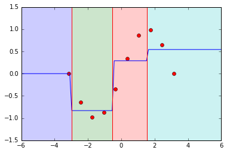

# Intuition behind Mondrian Trees

This example provides intuition behind Mondrian Trees. In particular, the differences between existing decision tree algorithms and explanations of the tree construction and prediction will be highlighted.

```python
import numpy as np
import matplotlib.pyplot as plt
from sklearn.tree import ExtraTreeRegressor
from skgarden import MondrianTreeRegressor
from itertools import cycle
%matplotlib inline
```

##  A decision tree regressor

A decision tree is one of the easier-to-understand machine learning algorithms. While training, the input training space `X` is recursively partitioned into a number of rectangular subspaces. While predicting the label of a new point, one determines the rectangular subspace that it falls into and outputs the label representative of that subspace. This is usually the mean of the labels for a regression problem.

The rectangular subspaces are constructed in a greedy manner doing a binary partition at a time. Hence this can be determined by a split `S`, a (f, \(\delta)\) tuple where f is the feature index and \(\delta\) is the threshold across which to split.

A point `x` for which `x[f]` is lesser than \(\delta\) is placed in the left subspace and vice versa.

## So how is each split done?

The optimal split \(S_{opt}\) is determined by \((f_{opt}, \delta_{opt}\)) that creates children such that the weighted decrease in impurity is maximum. Mathematically, this is the combination that maximizes, \(C=N_{parent} Imp_{Parent} - N_{left} Imp_{left} - N_{right} Imp_{right}\), where \(N_{parent}, N_{left}, N_{right}\) are the number of samples in the parent, left and right subspaces.

In a standard decision tree, \(S_{opt}\) is found out by searching though all possible combinations of feature indices and values in the training data and simply returning the combination that minimizes C as described above. That sounds pretty expensive!

In an extremely randomized tree this is made much faster by the following procedure.

1. The feature indices of the candidate splits are determined by drawing `max_features` at random.
2. Then for each of these feature index, we select the split threshold by drawing uniformly between the bounds of that feature.

When the set of candidate splits are obtained, as before we just return that split that minimizes `C`.

#### Note:
It is important to note that the actual reason is that while constructing an ensemble of trees, it makes sure that each tree constructed in an independent fashion. Decorrelating predictions in an ensemble is a key factor to achieve lower generalization error. For a highly unlikely corner case, if each tree in an ensemble is exactly the same, then there is no point constructing the ensemble.

Let us now generate some toy data to play with it in the remainder of this example. Here toy data, meaning a set of ten points that lie on a sine curve.


```python
def generate_toy_data(n_points=10):
    X_train = np.linspace(-np.pi, np.pi, n_points)
    y_train = np.sin(X_train)
    X_test = np.linspace(-6.0, 6.0, 100)
    y_test = np.sin(X_test)
    return np.expand_dims(X_train, axis=1), y_train, np.expand_dims(X_test, axis=1), y_test

X_train, y_train, X_test, y_test = generate_toy_data()
plt.plot(X_train.ravel(), y_train, "ro")
plt.show()
```


## Plotting decision boundaries using ERT's

Let us now use scikit-learn's `ExtraTreeRegressor` to train on the generated toy data, predict on some unseen data and plot decision boundaries in the 1-D space. Also, we set the `max_depth` parameter to 2, which means there can be a maximum of 4 decision boundaries in the 1-D space.


```python
def plot_1D_decision_boundaries(tree_reg, plt):
    x_l, x_u = plt.xlim()
    colors = cycle("bgrcmyk")
    split_thresh = tree_reg.tree_.threshold
    split_thresh = sorted(split_thresh[split_thresh != -2])
    split_thresh = [x_l] + split_thresh + [x_u]
    for s in split_thresh:
        plt.axvline(s, color="r", linestyle="-")

    for x_l, x_u in zip(split_thresh[1:], split_thresh[:-1]):
        plt.fill_between((x_l, x_u), -1.5, 1.5, alpha=0.2, color=next(colors))

etr = ExtraTreeRegressor(random_state=2, max_depth=2)
etr.fit(X_train, y_train)
y_pred = etr.predict(X_test)
plt.plot(X_train.ravel(), y_train, "ro")
plt.plot(X_test.ravel(), y_pred)
plt.ylim((-1.5, 1.5))
plot_1D_decision_boundaries(etr, plt)
plt.show()
```




The blue line represents the mean prediction in every region of the decision space. So if a point lies between -6 and -3, we predict y to be 0.0 and so on.

There are two things to notice.

1. As we move away from the training data, the predicted mean remains constant which is determined by the decision split at the bounds of the space. But in reality, we are unsure about the target value to predict and would like to fall back on some prior mean.
2. In an extremely randomized tree, this issue is not confined to subspaces at the edge of the training subspace. Even if the green subspace was not at the edge, we are unsure about the region from 4 to 6 since the train points are confined till 4.0

The mondrian tree solves this problem in a very intelligent way.

##  Mondrian Tree

### Train mode

The split tuple (f, \(\delta)\) is decided independently of the target or the decrease in impurity! Yes, that is right. When all the features are of same scale and are equally important, this is same as an extremely randomized tree with `max_features` set to 1.

1. The split feature index `f` is drawn with a probability proportional to `u_b[f] - l_b[f]` where `u_b` and `l_b` and the upper and lower bounds of all the features.
2. After fixing the feature index, the split threshold \(\delta\) is then drawn from a uniform distribution with limits `l_b`, `u_b`.

The intuition being that a feature that has a huge difference between the bounds is likelier to be an "important" feature. Every subspace `j` in a mondrian tree also stores information about.

1. The upper and lower bounds of all the features in that particular node or the bounding box as determined by the training data. For example, in the green subspace above it stores ((1.96, 3.0),)
2. The time of split \(\tau\) which is drawn from an exponential with mean \(\sum_{f=1}^D(u_b[f] - l_b[f])\). Smaller the value of tau, larger is the bounding box.

#### Note:
The time of split can be viewed as weighted depth. Imagine that edges between parent and child nodes are associated with a non-negative weight. The time of split at a node is the sum of the weights along the path from the root to the node. If weights are all 1, the time of split is the depth of the node.

###  Prediction mode
From now on, we will use the terms node and subspace interchangeably. The subspace that a new point ends up in is the leaf, the entire training space is the root and every binary partition results in two nodes.

Recall that for a decision tree, computing the prediction for a new point is fairly straightforward. Find the leaf node that a new point lands in and output the mean.

The prediction step of a Mondrian Tree is a bit more complicated. It takes into account all the nodes in the path of a new point from the root to the leaf for making a prediction. This formulation allows us the flexibility to weigh the nodes on the basis of how sure/unsure we are about the prediction in that particular node.

Mathematically, the distribution of \(P(Y | X)\) is given by

\(P(Y | X) = \sum_{j} w_j \mathcal{N} (m_j, v_j)\)

where the summation is across all the nodes in the path from the root to the leaf. The mean prediction becomes \(\sum_{j} w_j m_j\)

### Computing the weights.

Assume \(p_j(x)\) denote the probability of a new point splitting away from a node. That is higher the probability, the farther away it is from the bounding box at that node.

A point which is within the bounds at any node, the probability of separation should be zero. This means we can obtain a better estimate about the prediction from its child node.

Also, the node at which the new point starts to split away is the node that we are most confident about. So this should be given a high weight.

Formally, the weights are computed like this.

If `j` is not a leaf:

\(w_j(x) = p_j(x) \prod_{k \in anc(j)} (1 - p_k(x))\)

If `j` is a leaf, to make the weights sum up to one.

\(w_j(x) = 1 - \sum_{k \in anc(j)} w_k(x)\)

\(w_j\) can be decomposed into two factors, \(p_j\)(x) and \(\prod_{k \in anc(j)} (1 - p_k(x))\). The first one being the probability of splitting away at that particular node and the second one being the probability of not splitting away till it reaches that node. We can observe that for \(x\) that is completely within the bounds of a node, \(w_j(x)\) becomes zero and for a point where it starts branching off, \(w_j(x) = p_j(x)\)


### Computing the probability of separation.

We come to the final piece in the jigsaw puzzle, that is computing the probability of separation \(p_j(x)\) of each node. This is computed in the following way.

1. \(\Delta_{j} = \tau_{j} - \tau_{parent(j)}\)
2. \(\eta_{j}(x) = \sum_{f}(\max(x[f] - u_{bj}[f], 0) + \max(0, l_{bj}[f] - x[f]))\)
3. \(p_j(x) = 1 - e^{-\Delta_{j} \eta_{j}(x))}\)

Let us take some time to stare at these equations and understand what they mean.

1. \(p_j(x)\) is high when \(\eta_{j}(x)\) is high. As \(\eta_{j}(x)\) approaches infinity, \(p_j(x)\) approaches zero. This means that when the point is far away from the bounding box of the node, the probability of separation becomes high.
2. \(p_j(x)\) is high when \(\Delta{j}\) is high. This means when the bounding box of a node is small as compared to the bounding box of its parent, the probability of separation becomes high.
3. For a point in the training data, \(p_j(x)\) becomes zero for all nodes other than the leaf since the point is within the bounding box at all nodes. The leaf then has a weightage of 1.0 and this reduces to a standard decision tree prediction.
4. For a point far away from the training data, \(p_{root}(x)\) (and \(w_{root}(x)\)) approach one and hence the weights of the other nodes in the path from the root to the leaf approach zero. This means \(P(Y | X) = \mathcal{N}(m, v)\) where \(m\) and \(v\) are the empirical mean and variance of the training data.

## Plotting decision boundaries (and more) using Mondrian Trees

### Generate data, fit and predict


```python
X_train, y_train, X_test, y_test = generate_toy_data()
mtr = MondrianTreeRegressor(random_state=1, max_depth=2)
mtr.fit(X_train, y_train)
y_pred, y_std = mtr.predict(X_test, return_std=True)

# This is a method that provides the weights given to each node while making predictions.
weights = mtr.weighted_decision_path(X_test).toarray()
```

### Function to plot bounds and decision boundaries at every node.


```python
def plot_bounds_with_decision_boundaries(axis, X_tr, y_tr, X_te, y_te, tree_reg,
                                         depth=0):
    if depth > tree_reg.max_depth:
        raise ValueError("Expected depth <= %d, got %d" %
                         (tree_reg.max_depth, depth))
    colors = cycle("bgrcmyk")
    axis.set_ylim((-1.5, 1.5))
    axis.plot(X_tr.ravel(), y_tr, "ro")
    tree = tree_reg.tree_
    x_l, x_u = axis.get_xlim()
    if depth == 0:
        axis.axvline(np.min(X_tr))
        axis.axvline(np.max(X_tr))
        axis.fill_between((x_l, x_u), -1.5, 1.5, alpha=0.2, color=next(colors))
    else:
        # All nodes upto a particular depth.
        all_nodes = [0]
        parent_nodes = [0]
        curr_depth = 1
        while curr_depth < depth:
            curr_nodes = []
            while parent_nodes:
                nid = parent_nodes.pop()
                curr_nodes.append(tree.children_left[nid])
                curr_nodes.append(tree.children_right[nid])
            parent_nodes = curr_nodes
            all_nodes.extend(parent_nodes)
            curr_depth += 1
        thresholds = sorted([tree.threshold[node] for node in all_nodes])
        thresh = [x_l] + thresholds + [x_u]
        for start, end in zip(thresh[:-1], thresh[1:]):
            axis.fill_between((start, end), -1.5, 1.5, alpha=0.2, color=next(colors))
            X_1D = X_tr.ravel()
            X_1D = X_1D[np.logical_and(X_1D > start, X_1D < end)]
            axis.axvline(np.min(X_1D))
            axis.axvline(np.max(X_1D))
```

### Function to plot the weights at each node.


```python
def plot_weights(axis, x_test, weights, tree_reg, depth=0):
    tree = tree_reg.tree_
    x_l, x_u = axis.get_xlim()
    axis.set_ylim((0.0, 1.0))
    axis.set_title("weights at depth %d" % (depth))

    if depth == 0:
        axis.fill_between(x_test, 0.0, weights[:, 0], color="blue")

    else:
        # Node ids at a particular depth.
        parent_nodes = [0]
        curr_depth = 0
        while curr_depth < depth:
            curr_nodes = []
            while parent_nodes:
                nid = parent_nodes.pop()
                curr_nodes.append(tree.children_left[nid])
                curr_nodes.append(tree.children_right[nid])
            parent_nodes = curr_nodes
            curr_depth += 1

        weights = np.max(weights[:, parent_nodes], axis=1)
        axis.fill_between(x_test, 0.0, weights, color="blue")
```

### Plot all the things!!!


```python
fig, axes = plt.subplots(3, 2, sharex=True)
fig.set_size_inches(18.5, 10.5)
for ax1, ax2 in axes:
    ax1.set_xlim((-6.0, 6.0))
    ax2.set_xlim((-6.0, 6.0))
plot_weights(axes[0][0], X_test.ravel(), weights, mtr, depth=0)
plot_weights(axes[1][0], X_test.ravel(), weights, mtr, depth=1)
plot_weights(axes[2][0], X_test.ravel(), weights, mtr, depth=2)
plot_bounds_with_decision_boundaries(
    axes[0][1], X_train, y_train, X_test, y_test, mtr)
plot_bounds_with_decision_boundaries(
    axes[1][1], X_train, y_train, X_test, y_test, mtr, depth=1)
plot_bounds_with_decision_boundaries(
    axes[2][1], X_train, y_train, X_test, y_test, mtr, depth=2)
```


### Interpretation

Let us interpret the plots from top to bottom.

1. Depth zero: root

    * Weights are zero within the bounding box.
    * Weights start to increase as we move away from the bounding box, if we move far enough they will become one.

2. Depth one

    * Bounding box of left child is smaller than that of the right. Hence the time of split of the left bounding box   is larger which makes the probability of separation higher and the weights are larger.
    * The small spike in the middle is because of the thin strip between both the bounding boxes. The probability of
      separation here is non-zero and hence the weights are non-zero

3. Leaf

     * The weights here are just so that the total weights sum up to one.

### Conclusion

In conclusion, the mondrian tree regressor unlike standard decision tree implementations does not limit itself to
the leaf in making predictions. It takes into account the entire path from the root to the leaf and weighs it according to the distance from the bounding box in that node. This has some interesting properties such as falling back to the prior mean and variance for points far away from the training data.


### References:
1. Decision Trees and Forests: A Probabilistic Perspective, Balaji Lakshminarayanan
 [http://www.gatsby.ucl.ac.uk/~balaji/balaji-phd-thesis.pdf](http://www.gatsby.ucl.ac.uk/~balaji/balaji-phd-thesis.pdf)
2. scikit-learn documentation
[http://scikit-learn.org/](http://scikit-learn.org/)
3. Understanding Random Forests, Gilles Louppe
[https://arxiv.org/abs/1407.7502](https://arxiv.org/abs/1407.7502)
4.  Mondrian Forests: Efficient Online Random Forests, Balaji Lakshminarayanan, Daniel M. Roy, Yee Whye Teh
[https://arxiv.org/abs/1406.2673](https://arxiv.org/abs/1406.2673)

### Acknowledgements
This tutorial mainly arises from discussions with Gilles Louppe and Balaji Lakshminarayanan for which I am hugely grateful.
